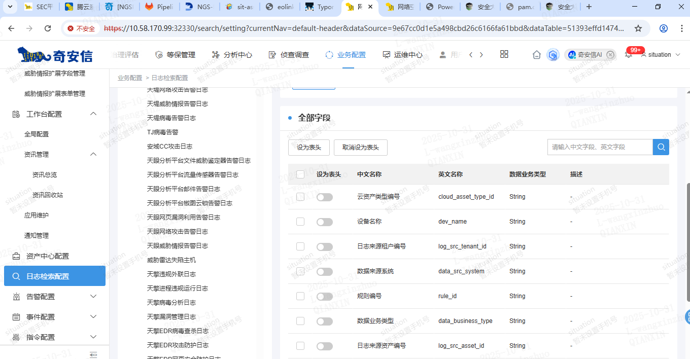

### 增加功能权限

kubectl get svc | grep zeus	获取所需IP及端口号

[示例文件](sources/add_auth-linkage.yaml)

```yaml
domain: 'dayu'                #domain
name: 'zeus'
state: 'plus'               #init位新注入一个domain,plus为在原有基础上增加资源
addr: '3.44.46.214:26781'

add:
  categories:
    - category: 'auth-linkage'
      display: '第三方联动'
      cdesc: '第三方联动'
      actions:
      	- action: 'manage'
          adesc: '管理' 
        - action: 'view'
          adesc: '查看'              
        - action: 'edit'
          adesc: '编辑'
          depends:
            - action: 'view'
              adesc: '查看'      
```

###### 增加功能权限示例


###### 数据库验证增加功能权限成功


##### 查看字段信息



##### 查看服务版本号

```
kubectl get pod | grep transmission

查看30000以上未被占用的端口
ss -tuln | awk '$5 ~ /:3[0-9]{4,}$/ {print $5}' | awk -F: '{print $NF}' | sort -n

2、将docker本地镜像以打包形式导出

一个业务镜像打包方法：
docker save -o leo.tar   situation-docker-beta.af-biz.qianxin-inc.cn/leo:v6120-beta.5

多个业务镜像打到一个包的方法：
docker save -o leo.tar   situation-docker-beta.af-biz.qianxin-inc.cn/leo:v6120-beta.5    situation-docker-beta.af-biz.qianxin-inc.cn/plan:v6120-beta.5

3、将docker镜像的包导入到当前服务器中
docker  load -i    leo.tar

kubectl logs malicious-657fb685df-6gr7h -c jar-maliciou
```

##### 固定服务到指定节点的指定端口

```
# 连接到指定的节点
ssh tg513dev01.zsy.bjyc.qianxin-inc.cn
# 查看该端口是否占用无输出即无占用
sudo netstat -tlnp | grep 30000
# 可以先修改为NodePort自动分配端口后再修改为指定端口

# 找到 Deployment 名称
kubectl get deployment | grep malicious

# 假设 Deployment 名称为 malicious，为其添加节点选择器
kubectl patch deployment malicious --type='json' -p='[{"op": "add", "path": "/spec/template/spec/nodeSelector", "value": {"kubernetes.io/hostname": "tg513dev01.zsy.bjyc.qianxin-inc.cn"}}]'
```


https://wiki.qianxin-inc.cn/pages/viewpage.action?pageId=525121560

https://wiki.qianxin-inc.cn/pages/viewpage.action?pageId=525121635 

https://wiki.qianxin-inc.cn/pages/viewpage.action?pageId=525121543 

提测的升级包，10.58.170.99上也有/data01/cqq/123/R3.10.7_C123_x86_TEST_update_20251107173255，有空熟悉熟悉

打印机插件 https://kb.qianxin.com/detail/bc1b4268537
